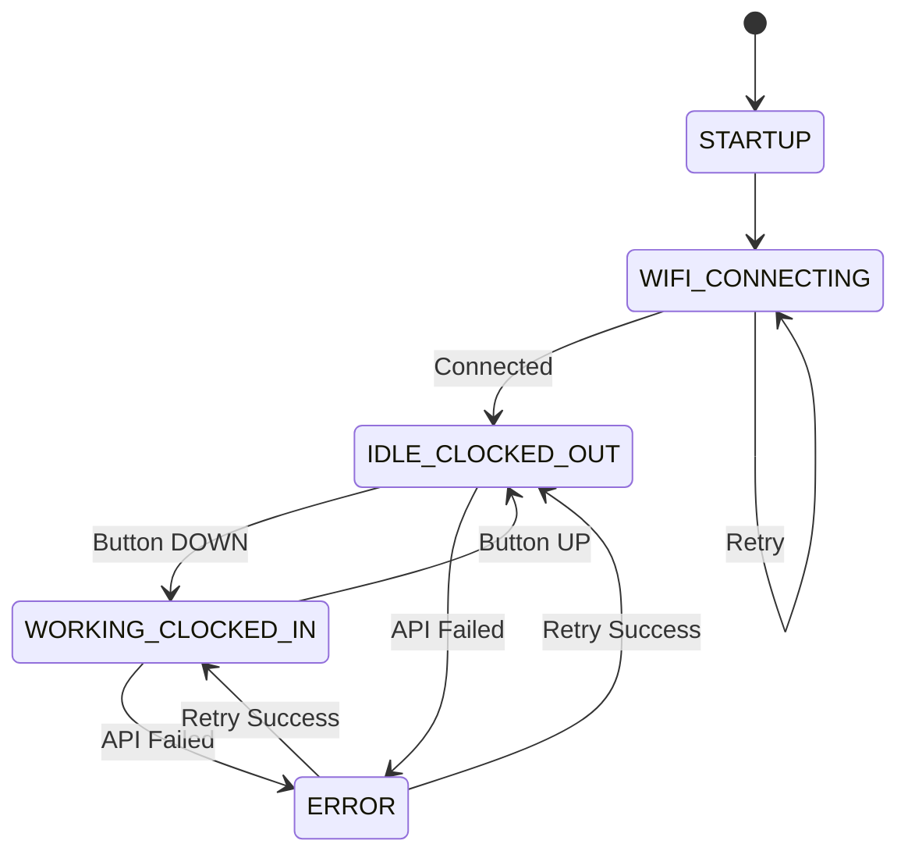

# Firmware Overview

The Wall Clock In Machine firmware is built using the Arduino framework for ESP32, providing a simple yet robust solution for time tracking.

## Architecture

The firmware follows a modular architecture with clear separation of concerns:

```
┌─────────────────────────────────────────┐
│            main.cpp                      │
│        (State Machine)                   │
└────────┬────────┬────────┬──────────────┘
         │        │        │
    ┌────▼───┐  ┌▼────┐  ┌▼─────────┐
    │ Button │  │ LED │  │   API    │
    │Handler │  │Ctrl │  │ Client   │
    └────────┘  └─────┘  └──────────┘
         │        │        │
    ┌────▼────────▼────────▼──────────┐
    │      Hardware Abstraction        │
    │  (ESP32 Arduino Framework)       │
    └──────────────────────────────────┘
```

## State Machine

The device operates as a finite state machine with 5 distinct states:



### State Descriptions

| State | LED Color | Description | Transitions |
|-------|-----------|-------------|-------------|
| **STARTUP** | 🔵 Blue pulse | Initial boot, loading config | → WIFI_CONNECTING |
| **WIFI_CONNECTING** | 🔵 Blue pulse | Connecting to WiFi | → IDLE or keep trying |
| **IDLE_CLOCKED_OUT** | 🔴 Red solid | Not working, idle | → WORKING (button down) |
| **WORKING_CLOCKED_IN** | 🟢 Green solid | Currently working | → IDLE (button up) |
| **ERROR** | 🟡 Yellow flash | API/WiFi error | → IDLE/WORKING (retry) |

## Code Structure

### File Organization

```
firmware/
├── platformio.ini          # Build configuration
├── src/
│   ├── main.cpp           # Main state machine (300 lines)
│   ├── config.h           # Configuration constants
│   ├── types.h            # Data structures & enums
│   │
│   ├── button_handler.h   # Button interface
│   ├── button_handler.cpp # Debouncing logic (100 lines)
│   │
│   ├── led_controller.h   # LED interface
│   ├── led_controller.cpp # LED animations (200 lines)
│   │
│   ├── api_client.h       # API interface
│   └── api_client.cpp     # HTTP/HTTPS client (250 lines)
│
└── test/
    ├── test_button.cpp    # Button unit tests
    └── test_led.cpp       # LED unit tests
```

### Module Responsibilities

#### 1. main.cpp - Application Core

**Responsibilities**:
- Initialize all subsystems
- Run main state machine loop
- Handle button events
- Coordinate LED updates
- Manage deep sleep

**Key Functions**:
```cpp
void setup()              // One-time initialization
void loop()               // Main event loop (runs continuously)
void handleButtonPress()  // React to button state changes
void updateEnergyMeter()  // Update work duration display
void goToSleep()          // Enter deep sleep mode
```

**Main Loop Flow**:
```cpp
loop() {
    1. Read button state
    2. Check for state changes
    3. Update LEDs
    4. Handle API calls
    5. Check for sleep conditions
    6. Repeat every 100ms
}
```

#### 2. button_handler - Input Processing

**Responsibilities**:
- Debounce mechanical switch
- Detect state changes
- Track button timing
- Detect long press (3 seconds)

**Key Functions**:
```cpp
void begin(pin)           // Initialize GPIO
void update()             // Call every loop
bool isPressed()          // Current state
ButtonEvent getEvent()    // Returns NONE/PRESSED/RELEASED/LONG_PRESS
```

**Debouncing Algorithm**:
```cpp
// Read switch 50ms apart
if (currentState != lastState) {
    debounceTimer = millis();
}
if ((millis() - debounceTimer) > DEBOUNCE_TIME) {
    stableState = currentState;
    if (stableState != previousState) {
        return PRESSED or RELEASED;
    }
}
```

#### 3. led_controller - Visual Feedback

**Responsibilities**:
- Control 8 WS2812B LEDs
- Status indicator (LED 0)
- Energy meter (LEDs 1-7)
- Animations (pulse, rainbow)

**Key Functions**:
```cpp
void begin(pin, numLeds)      // Initialize LED strip
void setStatus(color)         // Set status LED color
void setEnergyMeter(hours)    // Display work duration
void pulseStatus(color)       // Breathing animation
void rainbowCelebration()     // Completed workday animation
void clear()                  // Turn all LEDs off
```

**Energy Meter Algorithm**:
```cpp
// Map 0-8 hours to 7 LEDs with thermal gradient
hours = clamp(workHours, 0, 8);
ledCount = (hours / 8.0) * 7;

for (int i = 0; i < 7; i++) {
    if (i < ledCount) {
        // Gradient: Green → Yellow → Orange → Red
        hue = map(i, 0, 7, 96, 0);  // HSV hue
        leds[i+1] = CHSV(hue, 255, brightness);
    }
}
```

#### 4. api_client - Network Communication

**Responsibilities**:
- HTTPS communication with API
- Request retry logic
- JSON parsing
- Error handling

**Key Functions**:
```cpp
bool begin(endpoint, token)   // Initialize with credentials
bool clockIn()               // POST /api/timer/start
bool clockOut()              // POST /api/timer/stop
bool getCurrentStatus()      // GET /api/timer/current
```

**Retry Logic**:
```cpp
for (attempt = 1; attempt <= 3; attempt++) {
    result = sendRequest();
    if (result.success) {
        return true;
    }
    delay(attempt * 1000);  // Exponential backoff
}
return false;  // All retries failed
```

**Error Handling**:
```cpp
if (httpCode == 200) {
    parseJSON(response);
    return SUCCESS;
} else if (httpCode == 401) {
    return AUTH_ERROR;
} else if (httpCode >= 500) {
    return SERVER_ERROR;
} else {
    return NETWORK_ERROR;
}
```

## Configuration

All configurable parameters are in `config.h`:

### WiFi Settings

```cpp
#define WIFI_SSID "YourNetwork"      // Your WiFi name
#define WIFI_PASSWORD "password"     // Your WiFi password
#define WIFI_TIMEOUT_MS 30000        // 30 seconds to connect
```

### API Settings

```cpp
#define API_ENDPOINT "https://api.example.com"
#define API_TOKEN "your_bearer_token"
#define API_TIMEOUT_MS 10000         // 10 seconds per request
#define API_RETRY_COUNT 3            // Retry 3 times
```

### Hardware Pins

```cpp
#define BUTTON_PIN GPIO_NUM_2        // Toggle switch
#define LED_PIN GPIO_NUM_3           // WS2812B data
#define NUM_LEDS 8                   // Total LED count
```

### Timing

```cpp
#define DEBOUNCE_TIME_MS 50          // Button debounce
#define LONG_PRESS_TIME_MS 3000      // Long press = 3 seconds
#define SLEEP_TIMEOUT_MS 300000      // Sleep after 5 minutes
#define ENERGY_UPDATE_MS 300000      // Update meter every 5 min
```

### Power Management

```cpp
#define ENABLE_DEEP_SLEEP true       // Battery saving
#define DEEP_SLEEP_TIME_US 3600000000ULL  // Wake every hour
#define LED_BRIGHTNESS 64            // 0-255 (25% = longer battery)
```

## Data Structures

### Enums

```cpp
// Device operational states
enum DeviceState {
    STARTUP,
    WIFI_CONNECTING,
    IDLE_CLOCKED_OUT,
    WORKING_CLOCKED_IN,
    ERROR
};

// Button events
enum ButtonEvent {
    NONE,           // No change
    PRESSED,        // Button just pressed
    RELEASED,       // Button just released
    LONG_PRESS      // Held for 3+ seconds
};

// API response codes
enum ApiResult {
    SUCCESS,
    AUTH_ERROR,
    NETWORK_ERROR,
    SERVER_ERROR,
    TIMEOUT_ERROR
};
```

### Structures

```cpp
// Work session tracking
struct WorkSession {
    uint32_t startTime;    // Unix timestamp
    uint32_t duration;     // Seconds elapsed
    bool active;           // Currently working?
};

// WiFi credentials (stored in flash)
struct WiFiConfig {
    char ssid[32];
    char password[64];
    bool configured;
};

// API configuration (stored in flash)
struct ApiConfig {
    char endpoint[128];
    char token[256];
    bool configured;
};
```

## Libraries & Dependencies

The firmware uses these libraries (managed by PlatformIO):

| Library | Version | Purpose | Size |
|---------|---------|---------|------|
| **FastLED** | 3.6.0 | Control WS2812B LEDs | 50KB |
| **WiFiManager** | 2.0.16 | WiFi configuration portal | 30KB |
| **ArduinoJson** | 6.21.3 | Parse API responses | 20KB |
| **HTTPClient** | Built-in | Make HTTP/HTTPS requests | - |
| **Preferences** | Built-in | Store settings in flash | - |
| **WiFi** | Built-in | ESP32 WiFi driver | - |

**Total compiled size**: ~800KB (fits easily in 4MB flash)

## Memory Usage

### Flash Memory (Program Storage)

```
┌──────────────────────────┐ 4MB
│ Bootloader (64KB)        │
├──────────────────────────┤
│ Partition Table (4KB)    │
├──────────────────────────┤
│ NVS (20KB)              │ ← WiFi, API config stored here
├──────────────────────────┤
│ OTA Updates (1.8MB)     │ ← Reserved for firmware updates
├──────────────────────────┤
│ App Firmware (800KB)    │ ← Our code
├──────────────────────────┤
│ SPIFFS (1.3MB)          │ ← File system (unused)
└──────────────────────────┘
```

**Usage**: 800KB / 4MB = **20%**

### SRAM (Runtime Memory)

```
┌──────────────────────────┐ 400KB
│ Heap (240KB)            │ ← Dynamic allocation
├──────────────────────────┤
│ Stack (16KB)            │ ← Function calls
├──────────────────────────┤
│ Global vars (8KB)       │ ← Our variables
├──────────────────────────┤
│ WiFi buffers (80KB)     │ ← WiFi stack
├──────────────────────────┤
│ System reserved (56KB)   │ ← ESP32 system
└──────────────────────────┘
```

**Peak usage**: ~180KB / 400KB = **45%**

## Boot Sequence

The device follows this startup sequence:

```
0ms    Power On / Reset
│
├─ 100ms   ESP32 bootloader starts
│
├─ 500ms   Arduino framework initializes
│          - Setup serial communication
│          - Initialize GPIO pins
│          - Load preferences from flash
│
├─ 1000ms  Our setup() function runs
│          - Initialize button handler
│          - Initialize LED controller
│          - Show blue pulse (STARTUP state)
│
├─ 1500ms  WiFi connection starts
│          - Load WiFi credentials
│          - Attempt connection
│          - OR start configuration portal
│
├─ 2000ms  WiFi connected (if successful)
│          - Get current time from NTP
│          - Load API configuration
│          - Query current work status
│
├─ 2500ms  Ready for operation
│          - Show status LED (red or green)
│          - Update energy meter
│          - Enter main loop()
│
▼          Main loop runs every 100ms
```

**Typical boot time**: 2-3 seconds

## Power Management

### Sleep Strategy

The firmware aggressively uses deep sleep to maximize battery life:

```cpp
// Check for inactivity
if ((currentState == IDLE_CLOCKED_OUT) && 
    (millis() - lastActivity > SLEEP_TIMEOUT_MS)) {
    
    // Store state to flash
    preferences.putBool("clocked_in", false);
    preferences.end();
    
    // Configure wake-up source (button GPIO)
    esp_sleep_enable_ext0_wakeup(BUTTON_PIN, 0); // Wake on LOW
    
    // Also wake periodically to check WiFi
    esp_sleep_enable_timer_wakeup(DEEP_SLEEP_TIME_US);
    
    // Turn off LEDs
    ledController.clear();
    
    // Enter deep sleep (5µA current)
    esp_deep_sleep_start();
}
```

**Wake sources**:
1. **Button press** - Immediate wake
2. **Timer** - Wake every hour to check status
3. **Reset button** - Manual wake

### Power Consumption Timeline

```
Typical Day (Clocked Out):

00:00 ────┐                                    5µA (sleeping)
          │ Button press
07:30     ├─┐                                  80mA (5 sec)
          │ └── API call complete
          │                                    5µA (sleeping)
          │
12:00     ├─┐ Periodic wake                   80mA (2 sec)
          │ └──                                5µA
          │
18:00     ├─┐ Button press                    80mA (5 sec)
          │ └──
          │                                    5µA
23:59 ────┘
```

**Average**: ~15mA over 24 hours

## Error Handling

The firmware includes comprehensive error handling:

### WiFi Errors

```cpp
if (!WiFi.begin(ssid, password)) {
    // Credentials missing → Start config portal
    startConfigPortal();
}

if (WiFi.status() != WL_CONNECTED) {
    retryCount++;
    if (retryCount > MAX_RETRIES) {
        // Show error LED
        ledController.setStatus(COLOR_YELLOW);
        // Wait and retry
        delay(5000);
        retryCount = 0;
    }
}
```

### API Errors

```cpp
ApiResult result = apiClient.clockIn();

switch (result) {
    case SUCCESS:
        currentState = WORKING_CLOCKED_IN;
        ledController.setStatus(COLOR_GREEN);
        break;
        
    case AUTH_ERROR:
        // Invalid token → Show config portal
        startConfigPortal();
        break;
        
    case NETWORK_ERROR:
    case TIMEOUT_ERROR:
        // Retry with backoff
        ledController.pulseStatus(COLOR_YELLOW);
        delay(retryDelay);
        break;
        
    case SERVER_ERROR:
        // Server problem → Wait longer
        ledController.setStatus(COLOR_RED);
        delay(30000);
        break;
}
```

### Hardware Errors

```cpp
// Watchdog timer catches firmware hangs
esp_task_wdt_init(10, true);  // 10 second timeout
esp_task_wdt_add(NULL);

// Check for low battery
float voltage = analogRead(BATTERY_PIN) * (3.3 / 4095.0) * 2;
if (voltage < 3.2) {
    ledController.pulseStatus(COLOR_RED);
    // Show low battery warning
}

// Check LED strip connection
if (!FastLED.count()) {
    // LEDs not responding
    Serial.println("LED strip error");
}
```

## Testing

### Unit Tests

The firmware includes unit tests for critical components:

**Button Handler Tests** (`test_button.cpp`):
```cpp
void test_button_debounce()
void test_button_press_release()
void test_long_press_detection()
```

**LED Controller Tests** (`test_led.cpp`):
```cpp
void test_status_colors()
void test_energy_meter_gradient()
void test_animations()
```

**Running Tests**:
```bash
# Run all tests
pio test

# Run specific test
pio test -f test_button

# Run tests on hardware (connected ESP32)
pio test -e esp32c3
```

### Manual Testing Checklist

Before deploying firmware:

- [ ] Button press → Green LED + API call
- [ ] Button release → Red LED + API call
- [ ] Long press (3s) → Config portal starts
- [ ] WiFi disconnect → Reconnects automatically
- [ ] API timeout → Retries with backoff
- [ ] Deep sleep → Wakes on button press
- [ ] Battery low → Shows warning
- [ ] Energy meter → Updates every 5 minutes
- [ ] 8 hour work → Rainbow celebration

## Performance

### Response Times

| Action | Time | Notes |
|--------|------|-------|
| **Button press to LED** | <50ms | Instant feedback |
| **Button press to API call** | 200-500ms | Network latency |
| **WiFi reconnect** | 2-5 seconds | After disconnect |
| **Deep sleep wake** | 100ms | Fast resume |
| **Config portal start** | 3 seconds | On long press |

### Network Usage

| Operation | Data Transfer | Frequency |
|-----------|---------------|-----------|
| **Clock In** | ~200 bytes | Once per day |
| **Clock Out** | ~200 bytes | Once per day |
| **Status Check** | ~150 bytes | Once per hour |
| **NTP sync** | ~100 bytes | Once per day |

**Daily total**: <2KB

**Monthly total**: <60KB (negligible for any data plan)

## Firmware Updates

### OTA (Over-The-Air) Updates

The firmware supports OTA updates via WiFi:

```cpp
// Enable OTA updates in main.cpp
ArduinoOTA.setHostname("wallclockin-001");
ArduinoOTA.setPassword("update_password");
ArduinoOTA.begin();
```

**Update process**:
```bash
# Build new firmware
pio run

# Upload via WiFi (device must be on same network)
pio run -t upload --upload-port wallclockin-001.local
```

### USB Updates

Connect USB-C cable and flash directly:

```bash
# Upload via USB
pio run -t upload
```

**No bootloader button needed** - ESP32-C3 has native USB!

## Customization

### Adding New Features

Want to add a buzzer for audio feedback?

```cpp
// 1. Add to config.h
#define BUZZER_PIN GPIO_NUM_4

// 2. Initialize in setup()
pinMode(BUZZER_PIN, OUTPUT);

// 3. Add beep function
void beep(int duration) {
    digitalWrite(BUZZER_PIN, HIGH);
    delay(duration);
    digitalWrite(BUZZER_PIN, LOW);
}

// 4. Call in main loop
if (buttonEvent == PRESSED) {
    beep(100);  // 100ms beep
}
```

### Changing LED Colors

Edit `led_controller.cpp`:

```cpp
// Change color scheme
#define COLOR_IDLE      CRGB::Blue     // Instead of Red
#define COLOR_WORKING   CRGB::Purple   // Instead of Green
#define COLOR_ERROR     CRGB::Orange   // Instead of Yellow
```

### Adjusting Timings

Edit `config.h`:

```cpp
// More aggressive sleep (shorter timeout)
#define SLEEP_TIMEOUT_MS 60000        // 1 minute instead of 5

// More frequent energy meter updates
#define ENERGY_UPDATE_MS 60000        // 1 minute instead of 5

// Faster WiFi connection
#define WIFI_TIMEOUT_MS 10000         // 10 seconds instead of 30
```

## Next Steps

Ready to install the firmware?

- [**Installation Guide**](installation.md) - Flash firmware to ESP32
- [**Configuration Guide**](configuration.md) - Setup WiFi and API
- [**API Integration**](api-integration.md) - Connect to your backend

Or dive deeper:

- [**Source Code**](https://github.com/yourusername/wallClockInMachine/tree/main/firmware) - Browse on GitHub
- [**Development Guide**](../development/setup.md) - Build from source
- [**Troubleshooting**](../troubleshooting/firmware.md) - Fix firmware issues
