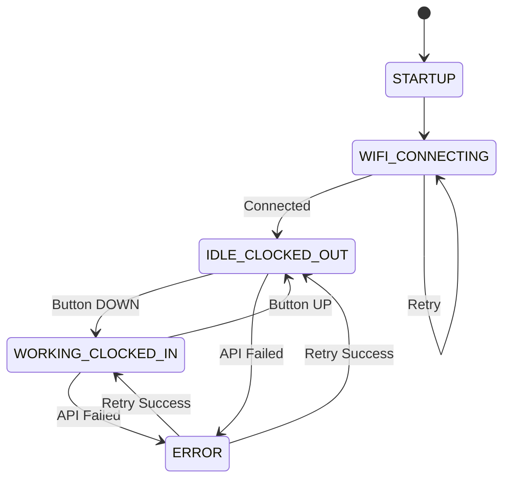

# Firmware Overview

The Wall Clock In Machine firmware is built in **pure Rust** for ESP32-C6 DevKitC-1, using state-of-the-art embedded tools. This provides a modern, safe, and efficient solution for time tracking.

## Technology Stack

- **esp-hal 0.20**: Pure Rust hardware abstraction (no C!)
- **Embassy 0.6**: Modern async/await runtime for embedded
- **defmt**: Zero-cost structured logging
- **Stable Rust**: No nightly toolchain required

## Architecture

The firmware uses a task-based async architecture with Embassy executor:

```
┌─────────────────────────────────────────┐
│         Embassy Executor                │
│         (Async Runtime)                 │
└────────┬────────┬────────┬──────────────┘
         │        │        │
    ┌────▼───┐  ┌▼────┐  ┌▼─────────┐
    │ Button │  │ LED │  │   WiFi   │
    │  Task  │  │Task │  │   Task   │
    │ (Async)│  │(Async)│ │ (Async) │
    └────────┘  └─────┘  └──────────┘
         │        │        │
    ┌────▼────────▼────────▼──────────┐
    │       esp-hal (Pure Rust)        │
    │      Hardware Abstraction        │
    └──────────────────────────────────┘
```

## State Machine

The device operates as a finite state machine with 5 distinct states:



### State Descriptions

| State | LED Color | Description | Transitions |
|-------|-----------|-------------|-------------|
| **STARTUP** | 🔵 Blue pulse | Initial boot, loading config | → WIFI_CONNECTING |
| **WIFI_CONNECTING** | 🔵 Blue pulse | Connecting to WiFi | → IDLE or keep trying |
| **IDLE_CLOCKED_OUT** | 🔴 Red solid | Not working, idle | → WORKING (button down) |
| **WORKING_CLOCKED_IN** | 🟢 Green solid | Currently working | → IDLE (button up) |
| **ERROR** | 🟡 Yellow flash | API/WiFi error | → IDLE/WORKING (retry) |

## Code Structure

### File Organization

```
firmware/
├── Cargo.toml             # Rust dependencies and config
├── rust-toolchain.toml    # Rust toolchain config
├── .cargo/config.toml     # Cargo target and runner
├── src/
│   ├── main.rs            # Main state machine
│   ├── config.rs          # Configuration constants
│   ├── types.rs           # Data structures & enums
│   ├── button.rs          # Button interface and debouncing
│   ├── led.rs             # LED interface and animations
│   ├── api.rs             # API interface and HTTP client
└── README.md              # Firmware overview
```

### Module Responsibilities

#### 1. main.rs - Application Core

**Responsibilities**:
- Initialize all subsystems
- Run main state machine loop
- Handle button events
- Coordinate LED updates
- Manage deep sleep

**Key Functions (Rust)**:
```rust
fn main()                // One-time initialization and main event loop
fn handle_button_press() // React to button state changes
fn update_energy_meter() // Update work duration display
fn go_to_sleep()         // Enter deep sleep mode
```

**Main Loop Flow (Rust)**:
```rust
loop {
    // 1. Read button state
    // 2. Check for state changes
    // 3. Update LEDs
    // 4. Handle API calls
    // 5. Check for sleep conditions
    // 6. Repeat every 100ms
}
```

#### 2. button.rs - Input Processing

**Responsibilities**:
- Debounce mechanical switch
- Detect state changes
- Track button timing
- Detect long press (3 seconds)

**Key Functions (Rust)**:
```rust
fn begin(pin: i32)                  // Initialize GPIO
fn update(&mut self)                // Call every loop
fn is_pressed(&self) -> bool        // Current state
fn event(&mut self) -> ButtonEvent  // Returns None/Pressed/Released/LongPress
```

**Debouncing Algorithm**:
```rust
// Read switch 50ms apart
if current_state != last_state {
    debounce_timer = now();
}
if now() - debounce_timer > DEBOUNCE_TIME {
    stable_state = current_state;
    if stable_state != previous_state {
        return Pressed or Released;
    }
}
```

#### 3. led_controller - Visual Feedback

**Responsibilities**:
- Control 8 WS2812B LEDs
- Status indicator (LED 0)
- Energy meter (LEDs 1-7)
- Animations (pulse, rainbow)

**Key Functions (Rust)**:
```rust
fn begin(pin: i32, num_leds: usize)        // Initialize LED strip
fn set_status(color: Rgb)                  // Set status LED color
fn set_energy_meter(hours: f32)            // Display work duration
fn pulse_status(color: Rgb)                // Breathing animation
fn rainbow_celebration()                   // Completed workday animation
fn clear()                                 // Turn all LEDs off
```

**Energy Meter Algorithm**:
```rust
// Map 0-8 hours to 7 LEDs with thermal gradient
let hours = clamp(work_hours, 0.0, 8.0);
let led_count = (hours / 8.0) * 7.0;

for i in 0..7 {
    if (i as f32) < led_count {
        // Gradient: Green → Yellow → Orange → Red
        let hue = map(i, 0, 7, 96, 0);  // HSV hue
        leds[i+1] = hsv_to_rgb(hue, 255, brightness);
    }
}
```

#### 4. api_client - Network Communication

**Responsibilities**:
- HTTPS communication with API
- Request retry logic
- JSON parsing
- Error handling

**Key Functions**:
```cpp
bool begin(endpoint, token)   // Initialize with credentials
bool clockIn()               // POST /api/timer/start
bool clockOut()              // POST /api/timer/stop
bool getCurrentStatus()      // GET /api/timer/current
```

**Retry Logic**:
```cpp
for (attempt = 1; attempt <= 3; attempt++) {
    result = sendRequest();
    if (result.success) {
        return true;
    }
    delay(attempt * 1000);  // Exponential backoff
}
return false;  // All retries failed
```

**Error Handling**:
```cpp
if (httpCode == 200) {
    parseJSON(response);
    return SUCCESS;
} else if (httpCode == 401) {
    return AUTH_ERROR;
} else if (httpCode >= 500) {
    return SERVER_ERROR;
} else {
    return NETWORK_ERROR;
}
```

## Configuration

All configurable parameters are in `config.rs`:

### WiFi Settings

```rust
pub const WIFI_CONNECT_TIMEOUT_SECS: u64 = 30;
```

WiFi credentials are currently **compile-time values** in `firmware/src/config.rs`
(`NETWORK_CONFIG`). A future version may move these into NVS + a config portal.

### API Settings

```rust
pub const API_TIMEOUT_SECS: u64 = 10; // 10 seconds per request
pub const API_RETRY_COUNT: u8 = 3;    // Retry 3 times
```

The actual host, port, and path for the API live in `NETWORK_CONFIG` in
`firmware/src/config.rs`.

### Hardware Pins

```rust
pub const BUTTON_PIN: i32 = 2;    // Toggle switch GPIO
pub const LED_PIN: i32 = 3;       // WS2812B data GPIO
pub const NUM_LEDS: usize = 8;    // Total LED count
```

### Timing

```rust
pub const DEBOUNCE_TIME_MS: u64 = 50;        // Button debounce
pub const LONG_PRESS_TIME_MS: u64 = 3_000;   // Long press = 3 seconds
pub const SLEEP_TIMEOUT_MS: u64 = 300_000;   // Sleep after 5 minutes
pub const ENERGY_UPDATE_MS: u64 = 300_000;   // Update meter every 5 min
```

### Power Management

```rust
pub const ENABLE_DEEP_SLEEP: bool = true;     // Battery saving
pub const DEEP_SLEEP_TIME_US: u64 = 3_600_000_000; // Wake every hour
pub const LED_BRIGHTNESS: u8 = 64;            // 0-255 (25% = longer battery)
```

## Data Structures

### Enums

```rust
// Device operational states
pub enum DeviceState {
    Startup,
    WifiConnecting,
    IdleClockedOut,
    WorkingClockedIn,
    Error,
}

// Button events
pub enum ButtonEvent {
    None,           // No change
    Pressed,        // Button just pressed
    Released,       // Button just released
    LongPress,      // Held for 3+ seconds
}

// API response codes
pub enum ApiResult {
    Success,
    AuthError,
    NetworkError,
    ServerError,
    TimeoutError,
}
```

### Structures

```rust
// Work session tracking
pub struct WorkSession {
    pub start_time: u64,    // Unix timestamp
    pub duration: u32,      // Seconds elapsed
    pub active: bool,       // Currently working?
}

// WiFi configuration (stored in NVS)
pub struct WifiConfig {
    pub ssid: heapless::String<32>,
    pub password: heapless::String<64>,
    pub configured: bool,
}

// API configuration (stored in NVS)
pub struct ApiConfig {
    pub endpoint: heapless::String<128>,
    pub token: heapless::String<256>,
    pub configured: bool,
}
```

## Libraries & Dependencies

The firmware uses these crates (managed by Cargo):

| Crate | Purpose |
|-------|---------|
| **esp-hal** | Pure Rust hardware abstraction (GPIO, timers, RMT, etc.) |
| **esp-wifi** | WiFi + network stack integration for ESP32-C6 |
| **embassy-executor / embassy-time / embassy-net** | Async runtime, timers, and TCP/IP |
| **smart-leds / esp-hal-smartled** | WS2812/NeoPixel color types and RMT-based driver |
| **serde / serde-json-core** | Data serialization for no_std environments |
| **heapless** | Fixed-size data structures (no allocator required) |
| **defmt** | Efficient logging over serial |

Buit with pure Rust for ESP32-C6 DevKitC-1 (`no_std` + `esp-hal`). Fits comfortably within
flash and RAM limits for this MCU.

## Memory Usage

### Flash Memory (Program Storage)

```
┌──────────────────────────┐ 4MB
│ Bootloader (64KB)        │
├──────────────────────────┤
│ Partition Table (4KB)    │
├──────────────────────────┤
│ NVS (20KB)              │ ← WiFi, API config stored here
├──────────────────────────┤
│ OTA Updates (1.8MB)     │ ← Reserved for firmware updates
├──────────────────────────┤
│ App Firmware (800KB)    │ ← Our code
├──────────────────────────┤
│ SPIFFS (1.3MB)          │ ← File system (unused)
└──────────────────────────┘
```

**Usage**: 800KB / 4MB = **20%**

### SRAM (Runtime Memory)

```
┌──────────────────────────┐ 400KB
│ Heap (240KB)            │ ← Dynamic allocation
├──────────────────────────┤
│ Stack (16KB)            │ ← Function calls
├──────────────────────────┤
│ Global vars (8KB)       │ ← Our variables
├──────────────────────────┤
│ WiFi buffers (80KB)     │ ← WiFi stack
├──────────────────────────┤
│ System reserved (56KB)   │ ← ESP32 system
└──────────────────────────┘
```

**Peak usage**: ~180KB / 400KB = **45%**

## Boot Sequence

The device follows this startup sequence:

```
0ms    Power On / Reset
│
├─ 100ms   ESP32 bootloader starts
│
├─ 500ms   HAL initializes (clocks, timers, GPIO)
│          - Setup serial communication
│          - Initialize GPIO pins
│          - Load config from NVS
│
├─ 1000ms  Rust main initializes subsystems
│          - Initialize button handler
│          - Initialize LED controller
│          - Show blue pulse (STARTUP state)
│
├─ 1500ms  WiFi connection starts
│          - Load WiFi credentials
│          - Attempt connection
│          - OR start configuration portal
│
├─ 2000ms  WiFi connected (if successful)
│          - Get current time from NTP
│          - Load API configuration
│          - Query current work status
│
├─ 2500ms  Ready for operation
│          - Show status LED (red or green)
│          - Update energy meter
│          - Enter main event loop
│
▼          Main loop runs every 100ms
```

**Typical boot time**: 2-3 seconds

## Power Management

### Sleep Strategy

The firmware aggressively uses deep sleep to maximize battery life:

```rust
// Check for inactivity
if idle_clocked_out && now.since(last_activity) > SLEEP_TIMEOUT {
    // Persist state (planned: NVS / flash-backed config)
    nvs.set_bool("clocked_in", false)?;

    // Configure wake-up sources
    wake_on_gpio(button_pin, Level::Low)?;     // Button press
    wake_on_timer(DEEP_SLEEP_TIME)?;           // Periodic wake

    // Turn off LEDs and sleep
    leds.clear();
    deep_sleep_start()?;                       // ~5µA current draw
}
```

**Wake sources**:
1. **Button press** - Immediate wake
2. **Timer** - Wake every hour to check status
3. **Reset button** - Manual wake

### Power Consumption Timeline

```
Typical Day (Clocked Out):

00:00 ────┐                                    5µA (sleeping)
          │ Button press
07:30     ├─┐                                  80mA (5 sec)
          │ └── API call complete
          │                                    5µA (sleeping)
          │
12:00     ├─┐ Periodic wake                   80mA (2 sec)
          │ └──                                5µA
          │
18:00     ├─┐ Button press                    80mA (5 sec)
          │ └──
          │                                    5µA
23:59 ────┘
```

**Average**: ~15mA over 24 hours

## Error Handling

The firmware includes comprehensive error handling:

### WiFi Errors

```cpp
if (!WiFi.begin(ssid, password)) {
    // Credentials missing → Start config portal
    startConfigPortal();
}

if (WiFi.status() != WL_CONNECTED) {
    retryCount++;
    if (retryCount > MAX_RETRIES) {
        // Show error LED
        ledController.setStatus(COLOR_YELLOW);
        // Wait and retry
        delay(5000);
        retryCount = 0;
    }
}
```

### API Errors

```cpp
ApiResult result = apiClient.clockIn();

switch (result) {
    case SUCCESS:
        currentState = WORKING_CLOCKED_IN;
        ledController.setStatus(COLOR_GREEN);
        break;
        
    case AUTH_ERROR:
        // Invalid token → Show config portal
        startConfigPortal();
        break;
        
    case NETWORK_ERROR:
    case TIMEOUT_ERROR:
        // Retry with backoff
        ledController.pulseStatus(COLOR_YELLOW);
        delay(retryDelay);
        break;
        
    case SERVER_ERROR:
        // Server problem → Wait longer
        ledController.setStatus(COLOR_RED);
        delay(30000);
        break;
}
```

### Hardware Errors

```cpp
// Watchdog timer catches firmware hangs
esp_task_wdt_init(10, true);  // 10 second timeout
esp_task_wdt_add(NULL);

// Check for low battery
float voltage = analogRead(BATTERY_PIN) * (3.3 / 4095.0) * 2;
if (voltage < 3.2) {
    ledController.pulseStatus(COLOR_RED);
    // Show low battery warning
}

// Check LED strip connection (visual validation)
// Optionally send a test frame and verify expected colors
```

## Testing

### Unit Tests

The firmware's pure logic can be tested on the host using Rust's testing framework:

```rust
// Example (host-side)
#[test]
fn button_long_press_detection() {
    // arrange inputs, simulate timing, assert events
}
```

Running tests locally:
```bash
cargo test
```

### Manual Testing Checklist

Before deploying firmware:

- [ ] Button press → Green LED + API call
- [ ] Button release → Red LED + API call
- [ ] Long press (3s) → Config portal starts
- [ ] WiFi disconnect → Reconnects automatically
- [ ] API timeout → Retries with backoff
- [ ] Deep sleep → Wakes on button press
- [ ] Battery low → Shows warning
- [ ] Energy meter → Updates every 5 minutes
- [ ] 8 hour work → Rainbow celebration

## Performance

### Response Times

| Action | Time | Notes |
|--------|------|-------|
| **Button press to LED** | <50ms | Instant feedback |
| **Button press to API call** | 200-500ms | Network latency |
| **WiFi reconnect** | 2-5 seconds | After disconnect |
| **Deep sleep wake** | 100ms | Fast resume |
| **Config portal start** | 3 seconds | On long press |

### Network Usage

| Operation | Data Transfer | Frequency |
|-----------|---------------|-----------|
| **Clock In** | ~200 bytes | Once per day |
| **Clock Out** | ~200 bytes | Once per day |
| **Status Check** | ~150 bytes | Once per hour |
| **NTP sync** | ~100 bytes | Once per day |

**Daily total**: <2KB

**Monthly total**: <60KB (negligible for any data plan)

## Firmware Updates

### OTA (Over-The-Air) Updates

> OTA updates can be implemented using the ESP32 OTA support exposed in Rust crates. This project currently focuses on USB flashing via `espflash`; OTA is an optional enhancement.

### USB Updates

Connect USB-C cable and flash directly:

```bash
# Flash via USB using espflash
espflash flash target/riscv32imc-esp-espidf/release/firmware
```

**No bootloader button needed** - ESP32-C6 DevKitC-1 has native USB!

## Customization

### Adding New Features

Want to add a buzzer for audio feedback?

```cpp
// 1. Add to config.h
#define BUZZER_PIN GPIO_NUM_4

// 2. Initialize in setup()
pinMode(BUZZER_PIN, OUTPUT);

// 3. Add beep function
void beep(int duration) {
    digitalWrite(BUZZER_PIN, HIGH);
    delay(duration);
    digitalWrite(BUZZER_PIN, LOW);
}

// 4. Call in main loop
if (buttonEvent == PRESSED) {
    beep(100);  // 100ms beep
}
```

### Changing LED Colors

Edit `led_controller.cpp`:

```cpp
// Change color scheme
#define COLOR_IDLE      CRGB::Blue     // Instead of Red
#define COLOR_WORKING   CRGB::Purple   // Instead of Green
#define COLOR_ERROR     CRGB::Orange   // Instead of Yellow
```

### Adjusting Timings

Edit `config.h`:

```cpp
// More aggressive sleep (shorter timeout)
#define SLEEP_TIMEOUT_MS 60000        // 1 minute instead of 5

// More frequent energy meter updates
#define ENERGY_UPDATE_MS 60000        // 1 minute instead of 5

// Faster WiFi connection
#define WIFI_TIMEOUT_MS 10000         // 10 seconds instead of 30
```

## Next Steps

Ready to install the firmware?

- [**Installation Guide**](installation.md) - Flash firmware to ESP32
- [**Configuration Guide**](configuration.md) - Setup WiFi and API
- [**API Integration**](api-integration.md) - Connect to your backend

Or dive deeper:

- [**Source Code**](https://github.com/lanterno/office-wall-clock/tree/main/firmware) - Browse on GitHub
- [**Architecture Guide**](architecture.md) - Understand the codebase
