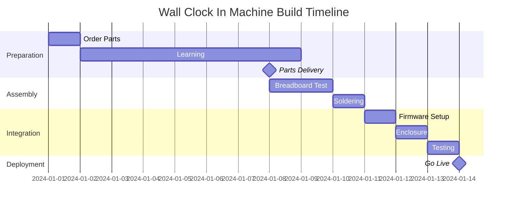

# Project Timeline

This guide provides a realistic timeline for building your Wall Clock In Machine from start to finish, customized for Lausanne residents.

## Overview

Total time from decision to working device: **2-4 weeks** (depending on part availability and your experience level)

## Phase 1: Planning & Ordering (Days 1-3)

### Day 1: Review & Decide
- [ ] Read through the [Overview](overview.md) and [Quick Start](quick-start.md) guides
- [ ] Review the [Bill of Materials](../hardware/bill-of-materials.md)
- [ ] Decide on budget tier (CHF 40-150)
- [ ] Check if you have FabLab EPFL access (students/staff)

**Time Required**: 1-2 hours

### Days 2-3: Order Components
- [ ] Order electronics from Digitec/Conrad or AliExpress
- [ ] Check FabLab EPFL tool availability for soldering
- [ ] Optional: Order custom enclosure parts or prepare for 3D printing

**Time Required**: 2-3 hours

**Expected Delivery**:
- Digitec/Conrad: 1-3 business days
- AliExpress: 2-4 weeks (budget option)
- Local pickup (Play Zone, Conrad): Same day

## Phase 2: Learning & Preparation (Days 4-10)

### While Waiting for Parts
- [ ] Read [Firmware Overview](../firmware/overview.md) and [Architecture](../firmware/architecture.md)
- [ ] Study [Wiring Diagram](../hardware/wiring.md)
- [ ] Watch soldering tutorials if you're a beginner
- [ ] Set up Rust toolchain and espflash
- [ ] Clone the firmware repository
- [ ] Test API connectivity (set up backend API first)

**Time Required**: 4-8 hours spread over a week

**Learning Resources**:
- Rust on ESP-IDF book
- smart-leds patterns and examples
- esp-idf-svc WiFi/HTTP examples
- FabLab EPFL workshops (check their schedule)

## Phase 3: Assembly (Days 11-14)

### Initial Setup (Day 11)
- [ ] Inventory all received components
- [ ] Test ESP32 with USB-C connection
- [ ] Flash test firmware (LED blink)
- [ ] Reserve FabLab EPFL time slot

**Time Required**: 1-2 hours

### Breadboard Prototype (Days 12-13)
- [ ] Follow [Breadboard Prototype](../assembly/breadboard.md) guide
- [ ] Connect all components without soldering
- [ ] Test button functionality
- [ ] Test LED animations
- [ ] Test WiFi connection and API calls

**Time Required**: 3-5 hours

### Soldering (Day 14)
- [ ] Book FabLab EPFL soldering station
- [ ] Follow [Soldering Guide](../assembly/soldering.md)
- [ ] Solder all connections
- [ ] Test each connection with multimeter
- [ ] Clean flux residue

**Time Required**: 3-4 hours (first time), 1-2 hours (experienced)

**Note**: FabLab staff can help with soldering if you're new!

## Phase 4: Integration & Testing (Days 15-17)

### Firmware Configuration (Day 15)
- [ ] Follow [Installation](../firmware/installation.md) guide
- [ ] Configure WiFi credentials via captive portal
- [ ] Set API endpoint URL
- [ ] Test button state transitions
- [ ] Verify LED energy meter animation

**Time Required**: 2-3 hours

### Enclosure Assembly (Days 16-17)
- [ ] Follow [Enclosure Assembly](../assembly/enclosure.md) guide
- [ ] Mount PCB/breadboard inside enclosure
- [ ] Install button and LED strip
- [ ] Secure battery
- [ ] Add rubber feet or mounting hardware

**Time Required**: 2-4 hours

### Final Testing (Day 17)
- [ ] Follow [Final Testing](../assembly/final-testing.md) checklist
- [ ] Test full work session cycle
- [ ] Verify battery charging
- [ ] Check LED indicators in various lighting conditions
- [ ] Stress test API connectivity

**Time Required**: 2 hours

## Phase 5: Deployment & Customization (Days 18-21)

### Desk Deployment (Day 18)
- [ ] Choose desk location (near desk edge, visible LEDs)
- [ ] Install mounting hardware if needed
- [ ] Connect USB-C charger cable
- [ ] Perform first "real" work session

**Time Required**: 30 minutes

### Fine-Tuning (Days 19-21)
- [ ] Adjust LED brightness for your environment
- [ ] Customize LED colors/animations
- [ ] Configure sleep/wake behavior
- [ ] Set button debounce timing if needed
- [ ] Optimize API retry intervals

**Time Required**: 2-3 hours spread over several days

## Timeline by Experience Level

### Beginner (No Electronics Experience)
- **Planning**: 3 days
- **Learning**: 1 week
- **Assembly**: 2-3 days
- **Testing**: 2 days
- **Total**: 3-4 weeks

**Recommendations**:
- Attend FabLab EPFL introduction workshop
- Ask for help during soldering
- Take your time with breadboard testing
- Don't skip the learning phase!

### Intermediate (Some Embedded/Rust Experience)
- **Planning**: 1-2 days
- **Learning**: 2-3 days
- **Assembly**: 1 day
- **Testing**: 1 day
- **Total**: 1-2 weeks

**Recommendations**:
- Use fast delivery options (Digitec Premium)
- Solder directly after breadboard verification
- Customize firmware early

### Advanced (Electronics & Firmware Experience)
- **Planning**: 1 day
- **Learning**: Parallel with assembly
- **Assembly**: 4-6 hours (same day)
- **Testing**: 2 hours
- **Total**: 1 week (mostly waiting for parts)

**Recommendations**:
- Order premium components from local stores
- Consider custom PCB design
- Add advanced features (haptic feedback, OLED display, etc.)

## Parallel Activities

These can be done simultaneously to save time:

## Contingency Planning

### Budget Extra Time For:
- **Component Delays**: +1-2 weeks for international shipping
- **Learning Curve**: +3-5 days if you're new to soldering
- **Troubleshooting**: +1-2 days for debugging issues
- **Rework**: +2-3 days if you need to re-solder connections

### Common Delays
1. **Customs**: AliExpress orders can get stuck (Swiss customs CHF 62 limit)
2. **FabLab Availability**: Book in advance during exam periods
3. **Part Defects**: Order 1-2 spare components (especially buttons)
4. **API Backend**: Ensure backend is deployed before testing

## Quick Win: 1-Day Prototype

If you need a working demo quickly:

**Morning** (3 hours):
1. Buy ESP32, button, and LED strip from Play Zone Lausanne
2. Use breadboard (no soldering)
3. Flash basic firmware

**Afternoon** (3 hours):
1. Test button + LED
2. Connect to WiFi
3. Mock API calls (or use test backend)

**Result**: Functional prototype without enclosure or battery (USB-powered only)

## Next Steps

Once you've completed your build:

1. Read [Daily Operation](../usage/daily-operation.md) for usage tips
2. Review [Troubleshooting](../troubleshooting/common-issues.md) for common issues
3. Consider contributing improvements to the project
4. Share your build with the community!

## Support

- **FabLab EPFL**: Drop-in hours Monday-Friday (check website for schedule)
- **GitHub Issues**: Report bugs or ask questions
- **EPFL CS Association**: Student tech community
- **Electronics Discord**: Swiss electronics community

---

**Questions?** Check the [FAQ](../reference/faq.md) or open an issue on GitHub!
