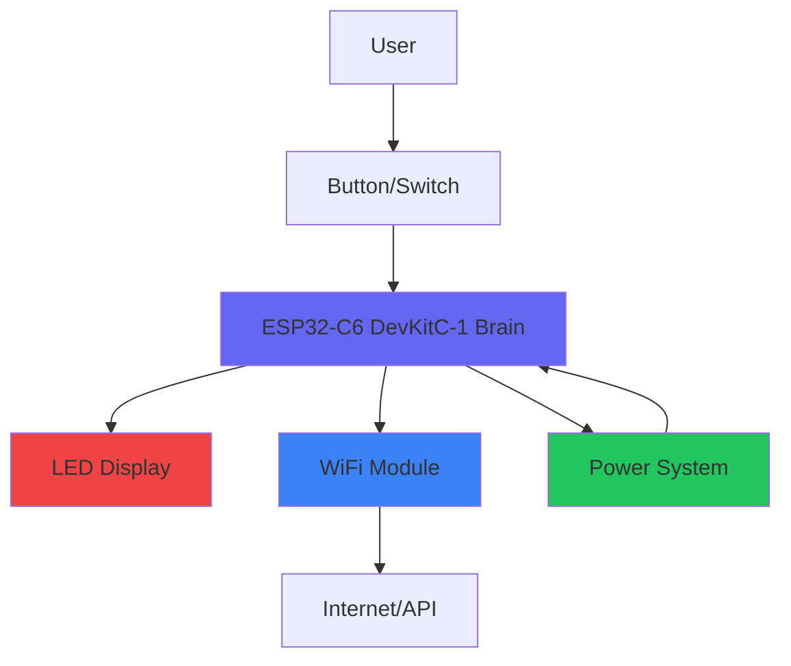

# Hardware Overview

Welcome to the hardware section! This page explains the physical components that make the Wall Clock In Machine work.

## System Architecture

The device consists of five main subsystems working together:



### 1. Input System (Button/Switch)

**Component**: SPDT Toggle Switch

The input is a mechanical toggle switch that can be in one of two stable positions:

- **Down Position** = Clocked In (Working)
- **Up Position** = Clocked Out (Not Working)

**Why a toggle switch instead of a button?**

- Physical state matches work state (no confusion)
- Accidental presses don't cause false triggers
- Tactile feedback confirms action
- No software state confusion after reboot

**Technical Details**:

- Type: Single Pole Double Throw (SPDT)
- Rating: 3A @ 125VAC
- Actuation Force: 200-300g
- Lifecycle: 100,000+ operations
- Connected to GPIO pin with internal pull-up resistor
- No external resistors needed

### 2. Processing Unit (ESP32-C6)

**Component**: ESP32-C6-DevKitC-1

The "brain" of the device is a modern RISC-V microcontroller:

**Key Features** (ESP32-C6 DevKitC-1):

- **32-bit RISC-V processor** @ 160MHz
- **Large on-chip SRAM** for program execution
- **On-board Flash** for code and data storage
- **WiFi 6 (802.11 b/g/n/ax) 2.4GHz**
- **Bluetooth LE** (future expansion)
- **Plenty of GPIO pins** for expansion
- **Native USB-C** (no UART adapter needed)

**Why ESP32-C6 DevKitC-1?**

| Requirement | ESP32-C6 DevKitC-1 | Alternatives |
|------------|----------|--------------|
| WiFi | ✅ Built-in | Arduino Uno + Shield $30 |
| Low Power | ✅ Deep sleep support | Raspberry Pi Zero: 100mA |
| USB Programming | ✅ Native | ESP8266 needs adapter |
| Cost | ✅ Low-cost devkit | Arduino Nano 33 IoT: $25 |
| Community | ✅ Growing ESP32-C6 ecosystem | New boards lack support |

**Pinout Overview**:

```
                ESP32-C6 DevKitC-1
           ┌───────────────┐
     3V3 ──┤ 1         21 ├── GND
 BUTTON ──┤ 2         20 ├── (unused)
    LED ──┤ 3         19 ├── USB-
     EN ──┤ 4         18 ├── USB+
    GND ──┤ 5         17 ├── (unused)
   (nc) ──┤ 6         16 ├── (nc)
   ...              ...
           └───────────────┘
```

### 3. Visual Feedback System (LEDs)

**Component**: WS2812B Addressable LED Strip

8 individually controllable RGB LEDs provide:

1. **Status LED** (LED 0): Shows current state
2. **Energy Meter** (LEDs 1-7): Work session duration

**LED Technology**:

- **Addressable**: Each LED can be different color
- **RGB**: 16.7 million color combinations
- **Chainable**: Single data pin controls all
- **Brightness**: 0-255 levels per channel
- **Power**: ~60mA per LED at full white

**Why WS2812B?**

- Single GPIO pin controls 8 LEDs
- No resistors or complex wiring
- Smooth animations possible
- Standard in maker community
- Cheap: $2 for 8 LEDs

**Color Scheme**:

| State | Status LED | Meaning |
|-------|-----------|---------|
| 🔴 Red | Solid | Clocked Out (Idle) |
| 🟢 Green | Solid | Clocked In (Working) |
| 🔵 Blue | Pulsing | Connecting to WiFi |
| 🟡 Yellow | Pulsing | API Communication |
| 🟣 Purple | Flash | Configuration Mode |
| 🌈 Rainbow | Animation | Workday Complete! |

**Energy Meter Colors**:

```
Hours:    0-1    1-3    3-5    5-7    7-8    8+
Color:   Green → → → Yellow → → Orange → Red
```

### 4. Connectivity System (WiFi)

**Component**: Built into ESP32-C3

**WiFi Specifications**:

- Protocol: 802.11 b/g/n (2.4GHz only)
- Security: WPA/WPA2/WPA3
- Range: 50-100m line-of-sight
- Power: 120mA during transmission
- Deep sleep: 5µA when idle

**Configuration Portal**:

On first boot, the device creates a WiFi network:

```
Network Name: WallClockIn_XXXXXX
Password: (none - open network)
Portal: http://192.168.4.1
```

Connect to this network and configure:

- Your WiFi network name (SSID)
- WiFi password
- API endpoint URL

Settings stored in flash memory (survives reboots).

**API Communication**:

- Protocol: HTTPS (TLS/SSL)
- Method: REST API (JSON)
- Endpoints: `/api/timer/start`, `/api/timer/stop`
- Retry Logic: 3 attempts with exponential backoff
- Timeout: 10 seconds per request

### 5. Power System

**Components**: LiPo Battery + Charger + Regulator

#### Battery (2000mAh LiPo)

- **Type**: Lithium Polymer
- **Voltage**: 3.7V nominal (4.2V full, 3.0V empty)
- **Capacity**: 2000mAh
- **Form Factor**: 503450 (50×34×5mm)
- **Weight**: 15g
- **Lifecycle**: 500+ charge cycles

**Runtime Calculation** (values approximate for ESP32-C6 DevKitC-1):

```
Average Current:
- ESP32 active: 80mA
- ESP32 sleep: 0.005mA (5µA)
- LEDs idle: 5mA (dim status LED)
- LEDs active: 60mA (8 LEDs at 1/4 brightness)

Duty Cycle (typical day):
- 5 minutes active (button press, API call)
- 8 hours working (LED on)
- Rest of day in deep sleep

Average: ~15mAh per day
Battery Life: 2000mAh / 15mAh = 133 hours = 10-14 days
```

#### Charger (TP4056)

- **Input**: USB-C, 5V
- **Output**: 4.2V (LiPo charging)
- **Current**: 1A max (configurable with resistor)
- **Protection**: Overcurrent, overvoltage, undervoltage
- **Indicator LEDs**: Red (charging), Green (full)
- **Charge Time**: 2-3 hours for 2000mAh

#### Voltage Regulator (AMS1117-3.3)

- **Input**: 3.0V - 5.0V (from battery or USB)
- **Output**: 3.3V (stable for ESP32)
- **Current**: 800mA max
- **Dropout**: 1.1V
- **Protection**: Thermal shutdown, current limiting

**Power Flow**:

```
USB-C ──→ TP4056 ──→ Battery ──→ AMS1117 ──→ ESP32-C3
   5V      Charger    3.7V     Regulator    3.3V
```

## Physical Specifications

### Enclosure Dimensions

```
   100mm
  ┌─────┐
  │     │ 60mm
  └─────┘
  Height: 35mm
```

- **Volume**: 210 cm³
- **Weight**: 85g (with battery)
- **Material**: 3D printed PLA or laser-cut acrylic

### Component Layout

```
Top View:
┌─────────────────────┐
│   [LED Strip]       │
│                     │
│     ┌─────┐         │
│     │ ESP │         │
│     └─────┘         │
│                     │
│    [Battery]        │
│                     │
│   ☐ [Switch]        │
└─────────────────────┘

Side View:
┌─────────────────────┐
│ LED | ESP | Battery │ ← 35mm height
└─────────────────────┘
```

## Component Specifications Summary

| Component | Model | Voltage | Current | Cost |
|-----------|-------|---------|---------|------|
| Microcontroller | ESP32-C6-DevKitC-1 | 3.3V | 80mA avg | $4 |
| LED Strip | WS2812B (8 LEDs) | 5V | 60mA max | $2 |
| Switch | SPDT Toggle | 3.3V | <1mA | $1 |
| Battery | LiPo 503450 2000mAh | 3.7V | - | $8 |
| Charger | TP4056 Module | 5V in | 1A | $2 |
| Regulator | AMS1117-3.3 | 3.0-5V | 800mA | $1 |
| Connectors | JST-PH 2.0 | - | - | $3 |
| Enclosure | 3D Printed PLA | - | - | $5 |
| USB Cable | USB-C | 5V | - | $3 |
| Misc | Wires, Solder | - | - | $2 |
| **TOTAL** | | | | **$31** |

## Safety Features

### Overcurrent Protection

- TP4056 limits charge current to 1A
- AMS1117 has built-in current limiting
- Battery has internal protection circuit

### Thermal Protection

- AMS1117 shuts down at 150°C
- ESP32-C6 throttles at 85°C (approx.)
- Battery disconnects at 80°C

### Voltage Protection

- TP4056 prevents overcharging (>4.2V)
- TP4056 prevents overdischarge (<3.0V)
- Reverse polarity protection on battery connector

### Software Protections

- Watchdog timer resets frozen firmware
- Deep sleep prevents battery drain
- API timeout prevents hung connections

## Expandability

The design includes expansion options:

### Available GPIO Pins

- **6 unused GPIO pins** for sensors/buttons
- **I2C interface** for displays/sensors
- **SPI interface** for SD cards/screens
- **ADC pins** for analog sensors

### Potential Expansions

1. **Temperature/Humidity Sensor** (DHT22) - track office conditions
2. **OLED Display** (128×64) - show time/status
3. **Buzzer** - audio feedback
4. **Motion Sensor** (PIR) - auto clock-out
5. **NFC Reader** - multi-user support
6. **Battery Gauge** (MAX17048) - precise battery %

### Bluetooth Capabilities

ESP32-C3 includes Bluetooth 5.0 LE:

- **Future mobile app** for configuration
- **BLE beacons** for proximity detection
- **Mesh networking** for multi-device setups

## Next Steps

Ready to build? Continue to:

- [**Bill of Materials**](bill-of-materials.md) - Shopping list with links
- [**Specifications**](specifications.md) - Detailed technical specs
- [**Enclosure Design**](enclosure-design.md) - 3D model and dimensions

Or jump ahead to:

- [**Assembly Guide**](../assembly/soldering.md) - Start building!
